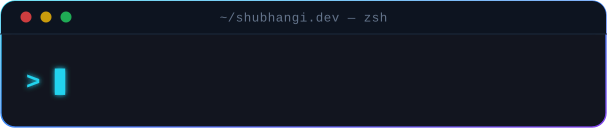

<!--
  GitHub Profile README
  Assets are stored in the /assets folder.
-->

 

 

Computer Science student · frontend developer · building interfaces that feel good to use

 

<table>
<tr>

<td width="36%" valign="top" align="center">

</td>

<td width="64%" valign="top">

 

I enjoy turning ideas into clean, interactive web experiences. I like working on interfaces where design and functionality come together naturally — from the overall layout down to the little interactions that make a page feel alive.

 

### Connect

</td>

</tr>
</table>

 

## `About Me`

I'm a Computer Science student who enjoys building things for the web and learning how different pieces of technology work together. I especially enjoy frontend development because it gives me a chance to combine logic with creativity and turn an idea into something people can actually interact with.

I like clean layouts, responsive designs, smooth interactions, and understanding what happens behind the interface. I'm also interested in AI/ML and enjoy exploring how programming, data, and intelligent systems can work together.

Right now, I'm focused on improving my problem-solving skills, building practical projects, and becoming a developer who can confidently work across both frontend and backend technologies.

- 🐍 Creator of **SnakeVerse**, a project I keep improving and experimenting with
- 🧩 I prefer understanding *why* something breaks instead of just patching it
- 🌱 Always learning by building projects and exploring new technologies
- 💻 Practicing programming, data structures, algorithms, and web development
- 🎯 Working toward becoming a Full-Stack Developer & AI/ML Engineer

 

## `Tech Stack`

 
## `GitHub Analytics`

  

  

---

Thanks for stopping by — always building, learning, and improving something new.

